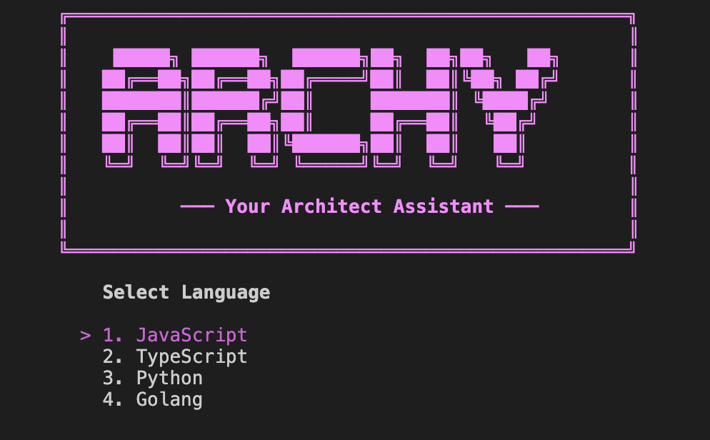

<div align="center">

<h1>⚡ Archy</h1>
<p><strong>A powerful TUI-based CLI tool to scaffold production-ready project structures — instantly.</strong></p>

<p>
  
  
  
  
</p>




</div>

---

## 📖 Overview

Archy eliminates the tedious boilerplate setup that slows down every new project. Through an elegant, interactive terminal interface, it guides you through selecting your language, framework, and architecture — then generates a complete, production-ready directory structure in seconds.

Stop copy-pasting folder skeletons. Start building.

---

## ✨ Features

| Feature | Description |
|---|---|
| **Interactive TUI** | Built with Bubble Tea, Lip Gloss, and Bubbles for a premium terminal experience |
| **Smart Scaffolding** | Generates working boilerplate scripts, config files, and basic routing — not just empty folders |
| **Multi-Language Support** | JavaScript (Express) and Python (FastAPI, Flask, Django) |
| **Dual Architecture Modes** | Choose between Monolith and Microservice patterns |
| **Modular Templates** | Easily extensible template system for adding new languages or frameworks |

---

## 🌐 Language & Framework Support

<table>
  <thead>
    <tr>
      <th>Language</th>
      <th>Framework</th>
      <th>Monolith</th>
      <th>Microservice</th>
    </tr>
  </thead>
  <tbody>
    <tr>
      <td rowspan="1"><strong>JavaScript</strong></td>
      <td>Express</td>
      <td align="center">✅</td>
      <td align="center">✅</td>
    </tr>
    <tr>
      <td rowspan="3"><strong>Python</strong></td>
      <td>FastAPI</td>
      <td align="center">✅</td>
      <td align="center">✅</td>
    </tr>
    <tr>
      <td>Flask</td>
      <td align="center">✅</td>
      <td align="center">✅</td>
    </tr>
    <tr>
      <td>Django</td>
      <td align="center">✅</td>
      <td align="center">✅</td>
    </tr>
  </tbody>
</table>

---

## 🛠 Installation

### Prerequisites

- [Go](https://golang.org/doc/install) **v1.25.3 or higher**

### Build from Source

```bash
# Clone the repository
git clone https://github.com/sachinggsingh/archy.git

# Navigate into the project
cd archy

# Build the binary
go build ./cmd/archy
```

---

## 🚀 Usage

Run Archy directly from your terminal:

```bash
go run ./cmd/archy/main.go
```

Archy walks you through a simple **4-step wizard**:

```
Step 1 — Select Language      →  JavaScript or Python
Step 2 — Select Framework     →  Express, FastAPI, Flask, Django
Step 3 — Select Architecture  →  Monolith or Microservice
Step 4 — Name Your Project    →  Enter the output directory name
```

Your scaffolded project will be generated in the current working directory. That's it — start coding.

---

## 📁 Project Structure

Archy itself follows a clean, modular internal architecture:

```
archy/
├── cmd/
│   └── archy/              # CLI entry point
├── internal/
│   ├── brand/              # Branding & ASCII art
│   ├── components/         # Reusable TUI components (List, Input, Spinner)
│   ├── generator/          # Core scaffolding logic
│   └── tui/                # Main TUI state machine & logic
└── templates/              # Language & framework-specific project templates
```

---

## 🔭 Future Ideas & Roadmap

The following languages and ecosystems are on the radar for upcoming Archy releases. Community contributions toward these are especially welcome!

### 🐹 Go (Golang)

<table>
  <thead>
    <tr>
      <th>Framework / Tool</th>
      <th>Architecture</th>
      <th>Notes</th>
    </tr>
  </thead>
  <tbody>
    <tr>
      <td><strong>Gin</strong></td>
      <td>Monolith · Microservice</td>
      <td>Lightweight HTTP router — ideal for REST APIs</td>
    </tr>
    <tr>
      <td><strong>Fiber</strong></td>
      <td>Monolith · Microservice</td>
      <td>Express-inspired, high-performance web framework</td>
    </tr>
    <tr>
      <td><strong>Echo</strong></td>
      <td>Monolith · Microservice</td>
      <td>Minimalist framework with great middleware support</td>
    </tr>
    <tr>
      <td><strong>Chi</strong></td>
      <td>Monolith</td>
      <td>Idiomatic router built on net/http</td>
    </tr>
    <tr>
      <td><strong>gRPC + Protobuf</strong></td>
      <td>Microservice</td>
      <td>Service-to-service communication scaffold</td>
    </tr>
    <tr>
      <td><strong>Standard Library (net/http)</strong></td>
      <td>Monolith</td>
      <td>Zero-dependency, idiomatic Go starter</td>
    </tr>
  </tbody>
</table>

### ⚙️ C++

<table>
  <thead>
    <tr>
      <th>Framework / Tool</th>
      <th>Architecture</th>
      <th>Notes</th>
    </tr>
  </thead>
  <tbody>
    <tr>
      <td><strong>Crow</strong></td>
      <td>Monolith · Microservice</td>
      <td>Fast C++ micro web framework inspired by Flask</td>
    </tr>
    <tr>
      <td><strong>Drogon</strong></td>
      <td>Monolith · Microservice</td>
      <td>High-performance async HTTP/WebSocket framework</td>
    </tr>
    <tr>
      <td><strong>Oat++</strong></td>
      <td>Monolith · Microservice</td>
      <td>Modern C++ web framework with ORM-like features</td>
    </tr>
    <tr>
      <td><strong>CMake Project</strong></td>
      <td>Monolith</td>
      <td>Bare-bones CMake + directory structure scaffold</td>
    </tr>
    <tr>
      <td><strong>gRPC (C++ server)</strong></td>
      <td>Microservice</td>
      <td>Protobuf-based service scaffold with CMake integration</td>
    </tr>
  </tbody>
</table>

### 🦀 Rust

<table>
  <thead>
    <tr>
      <th>Framework / Tool</th>
      <th>Architecture</th>
      <th>Notes</th>
    </tr>
  </thead>
  <tbody>
    <tr>
      <td><strong>Axum</strong></td>
      <td>Monolith · Microservice</td>
      <td>Ergonomic, modular framework built on Tokio</td>
    </tr>
    <tr>
      <td><strong>Actix-Web</strong></td>
      <td>Monolith · Microservice</td>
      <td>One of the fastest web frameworks in any language</td>
    </tr>
    <tr>
      <td><strong>Rocket</strong></td>
      <td>Monolith</td>
      <td>Type-safe, batteries-included Rust web framework</td>
    </tr>
    <tr>
      <td><strong>Warp</strong></td>
      <td>Monolith · Microservice</td>
      <td>Composable, filter-based HTTP framework</td>
    </tr>
    <tr>
      <td><strong>Tonic (gRPC)</strong></td>
      <td>Microservice</td>
      <td>Async gRPC with Protobuf, built on Tokio</td>
    </tr>
    <tr>
      <td><strong>Cargo Workspace</strong></td>
      <td>Microservice</td>
      <td>Multi-crate monorepo scaffold for distributed services</td>
    </tr>
  </tbody>
</table>

> 💡 **Want to contribute one of these?** Check out the [Contributing](#-contributing) section below and open a PR — new templates are always welcome!

---

## 🤝 Contributing

Contributions are welcome and appreciated! Whether it's a new framework template, a bug fix, or a UX improvement — feel free to get involved.

1. Fork the repository
2. Create your feature branch: `git checkout -b feature/add-rust-template`
3. Commit your changes: `git commit -m 'feat: add Rust + Axum template'`
4. Push to the branch: `git push origin feature/add-rust-template`
5. Open a Pull Request

Please open an issue first for major changes so we can discuss the approach.

---

## 📄 License

This project is licensed under the **MIT License** — see the [LICENSE](LICENSE) file for full details.

---

<div align="center">
  <p>Made with ❤️ by <a href="https://github.com/sachinggsingh">sachinggsingh</a></p>
  <p>If Archy saves you time, consider giving it a ⭐ on GitHub!</p>
</div>